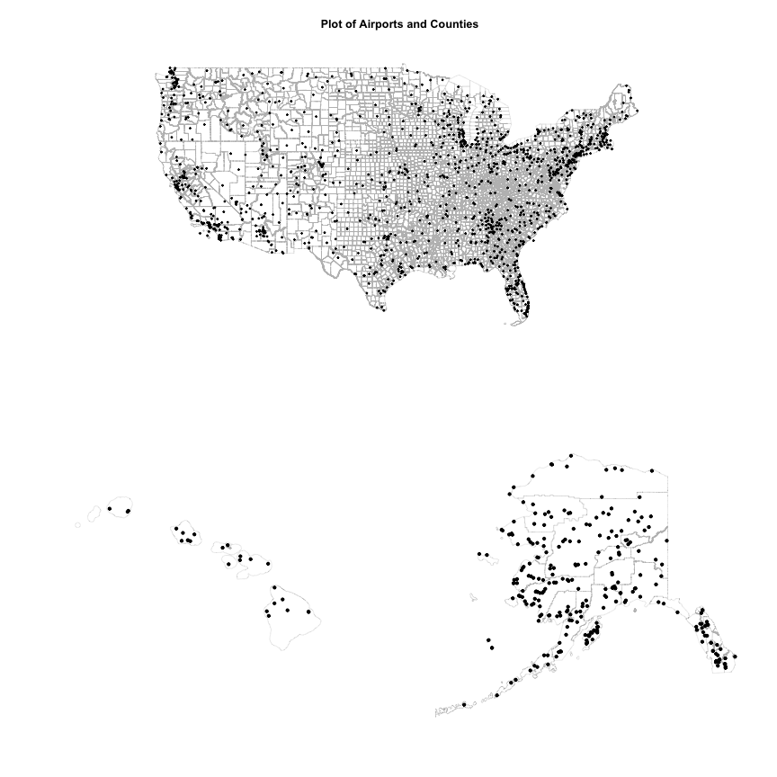

# Airport effects on U.S. County Unemployment Rates
Robby Powell  
`r format(Sys.Date(), '%Y-%B-%d')`  


# Introduction
This is my response to Ari Lamstein's 
R Shapefile [contest](http://www.arilamstein.com/blog/2016/07/12/announcing-r-shapefile-contest/). 

## Analysis Question
My Analysis consists of my efforts to answer the following questions:

  1. What is the effect of distance to the nearest airport on a county's unemployment rate?
  
  2. How does the traffic of the nearest airport affect unemployment rates?
  
## Analysis Plan
The Analysis plan is delineated below. 

1. Import and Clean Data.
2. Visualize each of the main data elements by year.
3. Visualize relationships between variables.
4. Visualize the airport locations on a U.S. Map with County boundaries.
5. Calculate Distances between county centroids and:
    a. the nearest airport
    b. the nearest airport in the Top 50 of average passenger movements
6. Visualize the distances in two maps.
7. Create a regression model and perform diagnostics.

## Data Sources
One of the rules of the contest is that the data are available for everyone to use. In order to meet this requirement, there are links for the data and shapefile locations below. 

  1. Airport Traffic: [Federal Aviation Administration (FAA)](http://www.faa.gov/airports/planning_capacity/passenger_allcargo_stats/passenger/)

  2. Airport Locations: [openflights.org](http://openflights.org/data.html)
  
  3. County Shapefile: [US Census Bureau](https://www.census.gov/geo/maps-data/data/tiger-line.html)
  
  4. Unemployment data: [Bureau of Labor Statistics (BLS)](http://download.bls.gov/pub/time.series/la/)
  
Where feasible, I have also included a series of scripts that may be used to download the exact files that I used for the analysis. These are located in the Appendicies along with the full analysis script for ease of implementation/testing by other analysts.
  
If it is not listed in this section, then it will be listed as either an R package, or it will be something that I create during the analysis and write-up processes.

# Setup
First, we need to set up our script for the analysis. In this case, we are setting up the main directory structure and the packages required for the analysis.

## Directory setup

In my case, I prefer to start the document off with setting up my main directories in variables. This allows me to use the `paste` and `paste0` functions in base R in order to ease the transfer of the scripts to other directories. 

If you change directories, then all you need to do is to alter the `main.dir` variable, and everything else will follow. This reduces the need for changing the directory in multiple locations throughout an analysis.


```r
# Main directory
main.dir <- "~/spatial-analysis-in-r/"

# Script directory
script.dir <- paste0(main.dir, "scripts/")

# data directory
dat.dir <- paste0(main.dir, "data/")
```

## Package setup

The packages utilized in this analysis are below. Unless otherwise noted, they are available from CRAN.

The comments after the packages explain why I am using them.


```r
# data import
library(openxlsx)

# data cleaning
library(tidyr)
library(dplyr)
library(magrittr)
library(stringr)

# data table display
library(Hmisc)
library(tables)

# general plotting
library(ggplot2)
library(gridExtra)

# refine plot displays
library(scales)
library(RColorBrewer)

# mapping
library(sp)
library(maps)
library(rgdal)
library(GISTools)
```

# Data Import and Cleaning
In this section, I will import and clean the data.

## BLS Data
First, I will import the main data set, which is labeled `la.data.64.County`. This contains all of the unemployment numbers.


```r
# Import UE Data
fname <- paste0(dat.dir, "/bls/la.data.64.County")
bls.dat <- read.delim(fname, header = TRUE, stringsAsFactors = FALSE, 
                      sep = "\t")

# trim white space in series_id
bls.dat$series_id <- trimws(bls.dat$series_id)

# change value to numeric
bls.dat$value <- as.numeric(bls.dat$value)
```

```
## Warning: NAs introduced by coercion
```

```r
head(bls.dat)
```

```
##              series_id year period value footnote_codes
## 1 LAUCN010010000000003 1990    M01   6.4               
## 2 LAUCN010010000000003 1990    M02   6.6               
## 3 LAUCN010010000000003 1990    M03   5.8               
## 4 LAUCN010010000000003 1990    M04   6.6               
## 5 LAUCN010010000000003 1990    M05   6.0               
## 6 LAUCN010010000000003 1990    M06   7.0
```

Upon examination, the missing values are for the years 2005 and 2006, which means that they are not of interest to this analysis.

After getting the basic preparation for the main dataset, it is time to import the crosswalks for easier identification.


```r
# Import la.measure
fname <- paste0(dat.dir, "/bls/la.measure")
bls.measure <- read.delim(fname, header = TRUE, stringsAsFactors = FALSE, 
                      sep = "\t")
```

After looking at this data, the variables are mis-labeled. These will be fixed below.


```r
# fix variables
bls.measure$measure_text <- bls.measure$measure_code
bls.measure$measure_code <- as.numeric(rownames(bls.measure))

bls.measure
```

```
##    measure_code      measure_text
## 03            3 unemployment rate
## 04            4      unemployment
## 05            5        employment
## 06            6       labor force
```

Import and examine the period definitions.


```r
# la.period
fname <- paste0(dat.dir, "/bls/la.period")
bls.period <- read.delim(fname, header = TRUE, stringsAsFactors = FALSE, 
                      sep = "\t")

bls.period
```

```
##    period period_abbr    period_name
## 1     M01         JAN        January
## 2     M02         FEB       February
## 3     M03         MAR          March
## 4     M04         APR          April
## 5     M05         MAY            May
## 6     M06         JUN           June
## 7     M07         JUL           July
## 8     M08         AUG         August
## 9     M09         SEP      September
## 10    M10         OCT        October
## 11    M11         NOV       November
## 12    M12         DEC       December
## 13    M13       AN AV Annual Average
```

Import series definitions, which contains the names of the counties.


```r
# la.period
fname <- paste0(dat.dir, "/bls/la.series")
bls.series <- read.table(fname, header = TRUE, stringsAsFactors = FALSE, 
                      sep = "\t")

# trim white space from series_id
bls.series$series_id <- trimws(bls.series$series_id)

head(bls.series)
```

```
##              series_id area_type_code       area_code measure_code
## 1 LASBS060000000000003              L BS0600000000000            3
## 2 LASBS060000000000004              L BS0600000000000            4
## 3 LASBS060000000000005              L BS0600000000000            5
## 4 LASBS060000000000006              L BS0600000000000            6
## 5 LASBS120000000000003              L BS1200000000000            3
## 6 LASBS120000000000004              L BS1200000000000            4
##   seasonal srd_code
## 1        S        6
## 2        S        6
## 3        S        6
## 4        S        6
## 5        S       12
## 6        S       12
##                                                                                  series_title
## 1 Unemployment Rate: Balance of California, state less Los Angeles-Long Beach-Glendale MD (S)
## 2      Unemployment: Balance of California, state less Los Angeles-Long Beach-Glendale MD (S)
## 3        Employment: Balance of California, state less Los Angeles-Long Beach-Glendale MD (S)
## 4       Labor Force: Balance of California, state less Los Angeles-Long Beach-Glendale MD (S)
## 5          Unemployment Rate: Balance of Florida, state less Miami-Miami Beach-Kendall MD (S)
## 6               Unemployment: Balance of Florida, state less Miami-Miami Beach-Kendall MD (S)
##   footnote_codes begin_year begin_period end_year end_period
## 1                      1976          M01     2016        M05
## 2                      1976          M01     2016        M05
## 3                      1976          M01     2016        M05
## 4                      1976          M01     2016        M05
## 5                      1990          M01     2016        M05
## 6                      1990          M01     2016        M05
```

Now that all of the necessary data elements are imported, it's time to do some cleaning on the BLS dataset. 

In this case, the data needs to be joined with the proper identifiers, and then the dataset will need to be reduced.

Because we are interested in the annual averages, we will filter for period `M13`. In addition, we will filter for the years 2011-2015. After we have joined the data, we will select only required variables.


```r
# filter for period M13
bls.dat <- bls.dat[bls.dat$period == "M13",]

# filter for year
bls.dat <- bls.dat[bls.dat$year %in% c(2011:2015),]
 
# Join data together via a left join.
bls.dat <- merge(bls.dat, bls.series,
                 by.x = "series_id", by.y = "series_id",
                 all.x = TRUE)

bls.dat <- merge(bls.dat, bls.measure,
                 by.x = "measure_code", by.y = "measure_code", all.x = TRUE)

# filter for unemployment rate
bls.dat <- bls.dat[bls.dat$measure_text == "unemployment rate", ]

# reduce dataset
bls.dat <- bls.dat[, c("series_id", "year", "value", 
                       "series_title", "measure_text")]

# Create county name and state variables for easier identification
bls.dat$county <- str_extract(bls.dat$series_title, 
                              "[A-za-z.//]*\\s*[A-za-z.//]*\\s*[A-Za-z.//]*,")
bls.dat$county <- trimws(gsub(",", "", bls.dat$county))

bls.dat$state <-  str_extract(bls.dat$series_title, "[A-Z]{2}")

# Extract FIPS Code
bls.dat$FIPS <- substr(bls.dat$series_id, 6, 10)

# Select columns
bls <- bls.dat[c("FIPS", "county", "state", "year", "value")]

# Change names
names(bls) <- c("FIPS", "county", "state", "year", "UE")
```

Here is the final BLS dataset.


```r
head(bls)
```

```
##    FIPS            county state year   UE
## 1 37161 Rutherford County    NC 2011 14.6
## 2 01001    Autauga County    AL 2013  6.2
## 3 47069   Hardeman County    TN 2011 12.1
## 4 01113    Russell County    AL 2014  6.6
## 5 21095     Harlan County    KY 2013 18.2
## 6 01005    Barbour County    AL 2011 11.5
```

```r
summary(bls)
```

```
##      FIPS              county             state                year     
##  Length:16135       Length:16135       Length:16135       Min.   :2011  
##  Class :character   Class :character   Class :character   1st Qu.:2012  
##  Mode  :character   Mode  :character   Mode  :character   Median :2013  
##                                                           Mean   :2013  
##                                                           3rd Qu.:2014  
##                                                           Max.   :2015  
##                                                           NA's   :40    
##        UE        
##  Min.   : 1.100  
##  1st Qu.: 5.100  
##  Median : 6.900  
##  Mean   : 7.386  
##  3rd Qu.: 9.000  
##  Max.   :28.900  
##  NA's   :40
```


## Airport Data
Here, we import and check the airport dataset. This dataset is really clean, so it will be utilized as-is.


```r
fname <- paste0(dat.dir, "airports/airports.dat.txt")
airports <- read.csv(fname, header = TRUE, stringsAsFactors = FALSE)

summary(airports)
```

```
##    airport.id       name               city             country         
##  Min.   :   1   Length:8107        Length:8107        Length:8107       
##  1st Qu.:2092   Class :character   Class :character   Class :character  
##  Median :4257   Mode  :character   Mode  :character   Mode  :character  
##  Mean   :4766                                                           
##  3rd Qu.:7508                                                           
##  Max.   :9541                                                           
##  iata.faa.code       icao.code            latitude      
##  Length:8107        Length:8107        Min.   :-90.000  
##  Class :character   Class :character   1st Qu.:  8.825  
##  Mode  :character   Mode  :character   Median : 34.988  
##                                        Mean   : 26.818  
##                                        3rd Qu.: 47.958  
##                                        Max.   : 82.518  
##    longitude           altitude         UTC.offset      
##  Min.   :-179.877   Min.   :-1266.0   Min.   :-12.0000  
##  1st Qu.: -79.022   1st Qu.:   38.0   1st Qu.: -5.0000  
##  Median :   5.292   Median :  272.0   Median :  1.0000  
##  Mean   :  -3.922   Mean   :  933.4   Mean   :  0.1692  
##  3rd Qu.:  49.786   3rd Qu.: 1020.0   3rd Qu.:  4.0000  
##  Max.   : 179.951   Max.   :14472.0   Max.   : 13.0000  
##      DST            time.zone.olson   
##  Length:8107        Length:8107       
##  Class :character   Class :character  
##  Mode  :character   Mode  :character  
##                                       
##                                       
## 
```

```r
head(airports)
```

```
##   airport.id                       name         city          country
## 1          1                     Goroka       Goroka Papua New Guinea
## 2          2                     Madang       Madang Papua New Guinea
## 3          3                Mount Hagen  Mount Hagen Papua New Guinea
## 4          4                     Nadzab       Nadzab Papua New Guinea
## 5          5 Port Moresby Jacksons Intl Port Moresby Papua New Guinea
## 6          6                 Wewak Intl        Wewak Papua New Guinea
##   iata.faa.code icao.code  latitude longitude altitude UTC.offset DST
## 1           GKA      AYGA -6.081689  145.3919     5282         10   U
## 2           MAG      AYMD -5.207083  145.7887       20         10   U
## 3           HGU      AYMH -5.826789  144.2959     5388         10   U
## 4           LAE      AYNZ -6.569828  146.7262      239         10   U
## 5           POM      AYPY -9.443383  147.2200      146         10   U
## 6           WWK      AYWK -3.583828  143.6692       19         10   U
##        time.zone.olson
## 1 Pacific/Port_Moresby
## 2 Pacific/Port_Moresby
## 3 Pacific/Port_Moresby
## 4 Pacific/Port_Moresby
## 5 Pacific/Port_Moresby
## 6 Pacific/Port_Moresby
```

## FAA Airport Traffic Data
The FAA Airport Data consists of three Excel spreadsheets. These will be imported and combined before they are cleaned.


```r
fname <- paste0(dat.dir, "faa/CY12AllEnplanements.xlsx")
faa.cy12 <- openxlsx::read.xlsx(fname)

fname <- paste0(dat.dir, "faa/cy13-all-enplanements.xlsx")
faa.cy13 <- openxlsx::read.xlsx(fname)

fname <- paste0(dat.dir, "faa/CY14-all-enplanements.xlsx")
faa.cy14 <- openxlsx::read.xlsx(fname, sheet = "data")

fname <- paste0(dat.dir, "faa/preliminary-cy15-all-enplanements.xlsx")
faa.cy15 <- openxlsx::read.xlsx(fname)

# Select Annual Data, Rename columns, and add year.
faa.cy11 <- faa.cy12[, c("ST", "Locid", "City", "Airport.Name", 
                         "CY.11.Enplanements")]
names(faa.cy11) <- c("state", "id", "city", "airport.name", "enplanements")
faa.cy11$year <- 2011

faa.cy12 <- faa.cy12[, c("ST", "Locid", "City", "Airport.Name", 
                         "CY.12.Enplanements")]
names(faa.cy12) <- c("state", "id", "city", "airport.name", "enplanements")
faa.cy12$year <- 2012

faa.cy13 <- faa.cy13[, c("ST", "Locid", "City", "Airport.Name",
                         "CY.13.Enplanements")]
names(faa.cy13) <- c("state", "id", "city", "airport.name", "enplanements")
faa.cy13$year <- 2013

faa.cy14 <- faa.cy14[, c("ST", "Locid", "City", "Airport.Name",
                         "CY.14.Enplanements")]
names(faa.cy14) <- c("state", "id", "city", "airport.name", "enplanements")
faa.cy14$year <- 2014

faa.cy15 <- faa.cy15[, c("ST", "Locid", "City", "Airport.Name",
                         "CY.15.Enplanements")]
names(faa.cy15) <- c("state", "id", "city", "airport.name", "enplanements")
faa.cy15$year <- 2015

# Combine
faa <- rbind(faa.cy11, faa.cy12, faa.cy13, faa.cy14, faa.cy15)

summary(faa)
```

```
##     state                id                city          
##  Length:8433        Length:8433        Length:8433       
##  Class :character   Class :character   Class :character  
##  Mode  :character   Mode  :character   Mode  :character  
##                                                          
##                                                          
##                                                          
##                                                          
##  airport.name        enplanements           year     
##  Length:8433        Min.   :       0   Min.   :2011  
##  Class :character   1st Qu.:       8   1st Qu.:2012  
##  Mode  :character   Median :     156   Median :2013  
##                     Mean   :  446406   Mean   :2013  
##                     3rd Qu.:    8240   3rd Qu.:2014  
##                     Max.   :49340732   Max.   :2015  
##                     NA's   :7
```

```r
head(faa)
```

```
##   state  id      city                        airport.name enplanements
## 1    AK ANC Anchorage Ted Stevens Anchorage International      2354987
## 2    AK FAI Fairbanks             Fairbanks International       438188
## 3    AK JNU    Juneau                Juneau International       355499
## 4    AK BET    Bethel                              Bethel       152366
## 5    AK KTN Ketchikan             Ketchikan International       102086
## 6    AK ENA     Kenai                     Kenai Municipal        90806
##   year
## 1 2011
## 2 2011
## 3 2011
## 4 2011
## 5 2011
## 6 2011
```


## Shapefile Import

```r
dsn <- "/Users/Robby/spatial-analysis-in-r/data/census/"
layer <- "tl_2015_us_county"
county <- rgdal::readOGR(dsn = dsn, layer = layer)
```

```
## OGR data source with driver: ESRI Shapefile 
## Source: "/Users/Robby/spatial-analysis-in-r/data/census/", layer: "tl_2015_us_county"
## with 3233 features
## It has 17 fields
```

Because the United States has such a large spread of territory around the world, it is necessary to set limits for the maps. In this case, we will be using maps for the Continental U.S. (CONUS), Alaska, and Hawaii. The limits chosen for this exercise are listed below.


```r
# Continental US (CONUS)
conus.min.lat <- 25
conus.max.lat <- 50
conus.min.long <- -126
conus.max.long <- -65

conus.long.limits <- c(conus.min.long, conus.max.long)
conus.lat.limits <- c(conus.min.lat, conus.max.lat)
```


```r
# Hawaii
hawaii.min.lat <- 18
hawaii.max.lat <- 23
hawaii.min.long <- -161 
hawaii.max.long <- -154

hawaii.long.limits <- c(hawaii.min.long, hawaii.max.long)
hawaii.lat.limits <- c(hawaii.min.lat, hawaii.max.lat)
```


```r
# Alaska
alaska.min.lat <- 52
alaska.max.lat <- 72
alaska.min.long <- -177
alaska.max.long <- -129

alaska.long.limits <- c(alaska.min.long, alaska.max.long)
alaska.lat.limits <- c(alaska.min.lat, alaska.max.lat)
```

## Identify Counties associated with Airports
Now that we have all of the data available, it is time to identify the relationship between the airports and counties. In this effort, I will first overlay the airports over the counties, and then determine which county contains the airports.

An output dataset will be produced, which can then be combined with all of the data to produce the final dataset.

First, in order to get an idea of what things look like, we will need to plot the airports and the counties on the same map. In order to reduce the number of images, I will put the maps together in a single image.


```r
# filter airport coordinates based on FAA codes in faa.data
airports <- airports[airports$country == "United States",]

#filter for CONUS, AK, and HI
airports <- 
  airports[(between(airports$latitude, conus.min.lat, conus.max.lat) &
           between(airports$longitude, conus.min.long, conus.max.long)) |
           (between(airports$latitude, hawaii.min.lat, hawaii.max.lat) &
           between(airports$longitude, hawaii.min.long, hawaii.max.long)) |
           (between(airports$latitude, alaska.min.lat, alaska.max.lat) &
           between(airports$longitude, alaska.min.long, alaska.max.long)),]

# Prep airport coordinates
coordinates(airports) <- c("longitude", "latitude")
proj4string(airports) <- proj4string(county)

layout(matrix(c(1,1,1,1,
                1,1,1,1,
                2,2,3,3,
                2,2,3,3), ncol = 4, nrow = 4, byrow = TRUE),
       respect = TRUE)

# CONUS Plot (Plot 1)
plot(county, xlim = conus.long.limits, ylim = conus.lat.limits,
     main = "Plot of Airports and Counties", border = "light grey",
     lwd = 0.25)
points(airports, xlim = conus.long.limits, ylim = conus.lat.limits,
       pch = 20, cex = 0.5)

# Hawaii Plot (Plot 2)
plot(county, xlim = hawaii.long.limits, ylim = hawaii.lat.limits,
     border = "light grey", lwd = 0.25)
points(airports, xlim = hawaii.long.limits, ylim = hawaii.lat.limits,
       pch = 20)

# Alaska Plot (Plot 3)
plot(county, xlim = alaska.long.limits, ylim = alaska.lat.limits,
     border = "light grey", lwd = 0.25)
points(airports, xlim = alaska.long.limits, ylim = alaska.lat.limits,
       pch = 20)
```

<!-- -->


```r
airports$county <- over(airports, county)[, c("GEOID", "NAMELSAD")]

head(airports$county)
```

```
##      GEOID        NAMELSAD
## 319  18133   Putnam County
## 1105 26027     Cass County
## 1122 39059 Guernsey County
## 1471 55029     Door County
## 1508 42133     York County
## 1618 41059 Umatilla County
```

## Calculate County Distance to the Nearest Airport

## Create Final Data Set

# Exploratory Analysis

# Setting up the Model Data Set

# Relationship between distance to airport and unemployment rate

## Training and Testing Datasets

## Training the Model

## Testing the Model

## Analyzing the Model

# Discussion

# Conclusions

# Computer Environment
The computer used for the analysis was a Late 2013 15" MacBook Pro, with 16 GB 1600 MHz DDR3 RAM and a 2.6 GHz Intel Core i7 Processor.


```r
sessionInfo()
```

```
## R version 3.3.1 (2016-06-21)
## Platform: x86_64-apple-darwin15.5.0 (64-bit)
## Running under: OS X 10.11.5 (El Capitan)
## 
## locale:
## [1] en_US.UTF-8/en_US.UTF-8/en_US.UTF-8/C/en_US.UTF-8/en_US.UTF-8
## 
## attached base packages:
## [1] stats     graphics  grDevices utils     datasets  methods   base     
## 
## other attached packages:
##  [1] GISTools_0.7-4     rgeos_0.3-19       MASS_7.3-45       
##  [4] maptools_0.8-39    rgdal_1.1-10       maps_3.1.0        
##  [7] sp_1.2-3           RColorBrewer_1.1-2 scales_0.4.0      
## [10] gridExtra_2.2.1    tables_0.7.79      Hmisc_3.17-4      
## [13] ggplot2_2.1.0      Formula_1.2-1      survival_2.39-5   
## [16] lattice_0.20-33    stringr_1.0.0      magrittr_1.5      
## [19] dplyr_0.5.0        tidyr_0.5.1        openxlsx_3.0.0    
## 
## loaded via a namespace (and not attached):
##  [1] Rcpp_0.12.5         formatR_1.4         plyr_1.8.4         
##  [4] tools_3.3.1         rpart_4.1-10        digest_0.6.9       
##  [7] evaluate_0.9        tibble_1.1          gtable_0.2.0       
## [10] Matrix_1.2-6        DBI_0.4-1           yaml_2.1.13        
## [13] knitr_1.13          cluster_2.0.4       grid_3.3.1         
## [16] nnet_7.3-12         data.table_1.9.6    R6_2.1.2           
## [19] foreign_0.8-66      rmarkdown_1.0       latticeExtra_0.6-28
## [22] htmltools_0.3.5     splines_3.3.1       assertthat_0.1     
## [25] colorspace_1.2-6    stringi_1.1.1       acepack_1.3-3.3    
## [28] munsell_0.4.3       chron_2.3-47
```

# Appendices
This section will show the full code of the analysis scripts.

## Appendix A: Complete Analysis


## Appendix B: Airport Location from openflight.org

```r
# File url
file <- "https://raw.githubusercontent.com/jpatokal/openflights/master/data/airports.dat"

# destination
dest <- "~/spatial-analysis-in-r/data/airports/airports.dat.txt"

# download file
download.file(file, dest)

# Check downloaded file
airports <- read.csv(dest, header = FALSE)

# name columns
names(airports) <- c("airport.id", "name", "city", "country", "iata.faa.code",
                     "icao.code", "latitude", "longitude", "altitude",
                     "UTC.offset", "DST", "time.zone.olson")

# save file with column names
  write.csv(airports, dest, row.names = FALSE)
```

## Appendix C: County Shapefile from Census Bureau

```r
# County shapefile url
url <- "ftp://ftp2.census.gov/geo/tiger/TIGER2015/COUNTY/tl_2015_us_county.zip"

# path
path <- "~/spatial-analysis-in-r/data/census/"

# destination
dest <- paste0(path, "tl_2015_us_county.zip")

# download file
download.file(url, dest)

# unzip file
unzip(dest, exdir = path, junkpaths = TRUE)
```

## Appendix D: BLS Data

```r
# Set main part of url for downloading the files
main.url <- "http://download.bls.gov/pub/time.series/la/"

# Set main directory for download
download.dir <- "~/spatial-analysis-in-r/data/bls/"

# List of files to download
file.list <- c("la.area", "la.area_type", "la.data.64.County", "la.measure",
               "la.period", "la.series", "la.state_region_division")

# combine download urls
download.urls <- unlist(lapply(main.url, FUN = "paste0", file.list))

# combine for file locations
download.locations <- unlist(lapply(download.dir, FUN = "paste0", file.list))

# download files
for (file in 1:length(file.list)) {
  if (!(file.list[file] %in% dir(download.dir))) {
    download.file(url = download.urls[file], destfile = download.locations[file])
  }
}
```
